

Huy Phạm · Huytn593

Software Engineering · IT, AI & Automation · Vietnam · Building practical software

[Portfolio](https://huytn593.github.io) · [GitHub](https://github.com/huytn593)

<!-- AWAKEN:START -->
<!-- Generated by git-profile-awaken. Edit awaken.json instead of this block. -->

<picture><source media="(prefers-color-scheme: dark)" srcset="awaken/banner-dark.svg"><source media="(prefers-color-scheme: light)" srcset="awaken/banner-light.svg"></picture>

<picture><source media="(prefers-color-scheme: dark)" srcset="awaken/bio-dark.svg"><source media="(prefers-color-scheme: light)" srcset="awaken/bio-light.svg"></picture>
<picture><source media="(prefers-color-scheme: dark)" srcset="awaken/career-dark.svg"><source media="(prefers-color-scheme: light)" srcset="awaken/career-light.svg"></picture>

<picture><source media="(prefers-color-scheme: dark)" srcset="awaken/hunter-dark.svg"><source media="(prefers-color-scheme: light)" srcset="awaken/hunter-light.svg"></picture>

<picture><source media="(prefers-color-scheme: dark)" srcset="awaken/status-dark.svg"><source media="(prefers-color-scheme: light)" srcset="awaken/status-light.svg"></picture>

<picture><source media="(prefers-color-scheme: dark)" srcset="awaken/ladder-dark.svg"><source media="(prefers-color-scheme: light)" srcset="awaken/ladder-light.svg"></picture>

<picture><source media="(prefers-color-scheme: dark)" srcset="awaken/web-dark.svg"><source media="(prefers-color-scheme: light)" srcset="awaken/web-light.svg"></picture>

<picture><source media="(prefers-color-scheme: dark)" srcset="awaken/arsenal-dark.svg"><source media="(prefers-color-scheme: light)" srcset="awaken/arsenal-light.svg"></picture>

<picture><source media="(prefers-color-scheme: dark)" srcset="awaken/skills-dark.svg"><source media="(prefers-color-scheme: light)" srcset="awaken/skills-light.svg"></picture>

<picture><source media="(prefers-color-scheme: dark)" srcset="awaken/activity-dark.svg"><source media="(prefers-color-scheme: light)" srcset="awaken/activity-light.svg"></picture>

<picture><source media="(prefers-color-scheme: dark)" srcset="awaken/contribution-dark.svg"><source media="(prefers-color-scheme: light)" srcset="awaken/contribution-light.svg"></picture>
<picture><source media="(prefers-color-scheme: dark)" srcset="awaken/combat-dark.svg"><source media="(prefers-color-scheme: light)" srcset="awaken/combat-light.svg"></picture>

<picture><source media="(prefers-color-scheme: dark)" srcset="awaken/hours-dark.svg"><source media="(prefers-color-scheme: light)" srcset="awaken/hours-light.svg"></picture>

<picture><source media="(prefers-color-scheme: dark)" srcset="awaken/achievements-dark.svg"><source media="(prefers-color-scheme: light)" srcset="awaken/achievements-light.svg"></picture>

<picture><source media="(prefers-color-scheme: dark)" srcset="awaken/quest-dark.svg"><source media="(prefers-color-scheme: light)" srcset="awaken/quest-light.svg"></picture>
<picture><source media="(prefers-color-scheme: dark)" srcset="awaken/daily-dark.svg"><source media="(prefers-color-scheme: light)" srcset="awaken/daily-light.svg"></picture>

<picture><source media="(prefers-color-scheme: dark)" srcset="awaken/oracle-dark.svg"><source media="(prefers-color-scheme: light)" srcset="awaken/oracle-light.svg"></picture>

<a href="https://github.com/huytn593"><picture><source media="(prefers-color-scheme: dark)" srcset="awaken/contact-1-github-dark.svg"><source media="(prefers-color-scheme: light)" srcset="awaken/contact-1-github-light.svg"></picture></a>
<a href="https://huytn593.github.io"><picture><source media="(prefers-color-scheme: dark)" srcset="awaken/contact-2-website-dark.svg"><source media="(prefers-color-scheme: light)" srcset="awaken/contact-2-website-light.svg"></picture></a>
<picture><source media="(prefers-color-scheme: dark)" srcset="awaken/rune-str-dark.svg"><source media="(prefers-color-scheme: light)" srcset="awaken/rune-str-light.svg"></picture>
<picture><source media="(prefers-color-scheme: dark)" srcset="awaken/rune-agi-dark.svg"><source media="(prefers-color-scheme: light)" srcset="awaken/rune-agi-light.svg"></picture>

<picture><source media="(prefers-color-scheme: dark)" srcset="awaken/rune-int-dark.svg"><source media="(prefers-color-scheme: light)" srcset="awaken/rune-int-light.svg"></picture>
<picture><source media="(prefers-color-scheme: dark)" srcset="awaken/rune-vit-dark.svg"><source media="(prefers-color-scheme: light)" srcset="awaken/rune-vit-light.svg"></picture>
<picture><source media="(prefers-color-scheme: dark)" srcset="awaken/rune-luk-dark.svg"><source media="(prefers-color-scheme: light)" srcset="awaken/rune-luk-light.svg"></picture>
<picture><source media="(prefers-color-scheme: dark)" srcset="awaken/rune-cha-dark.svg"><source media="(prefers-color-scheme: light)" srcset="awaken/rune-cha-light.svg"></picture>

<!-- AWAKEN:END -->